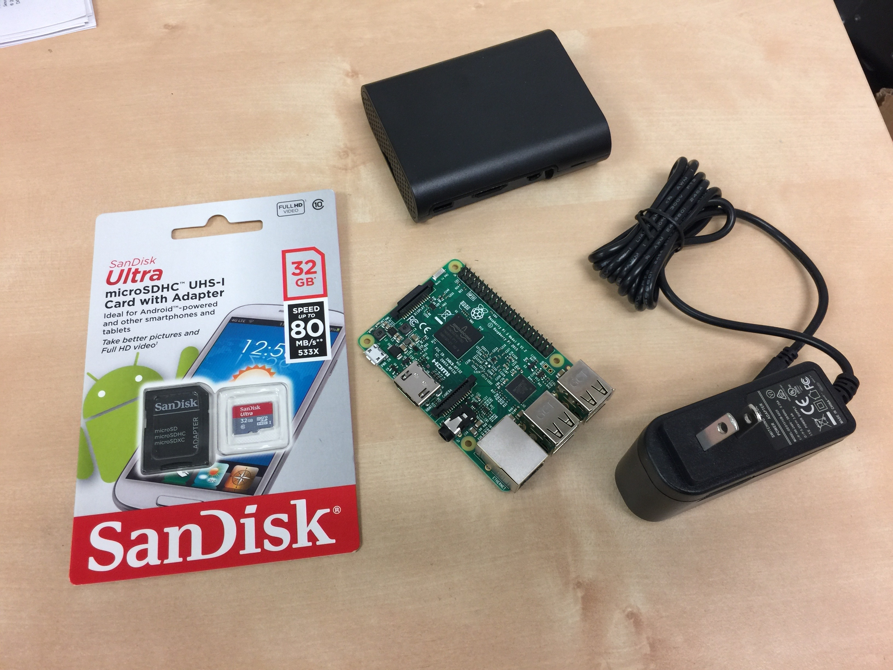
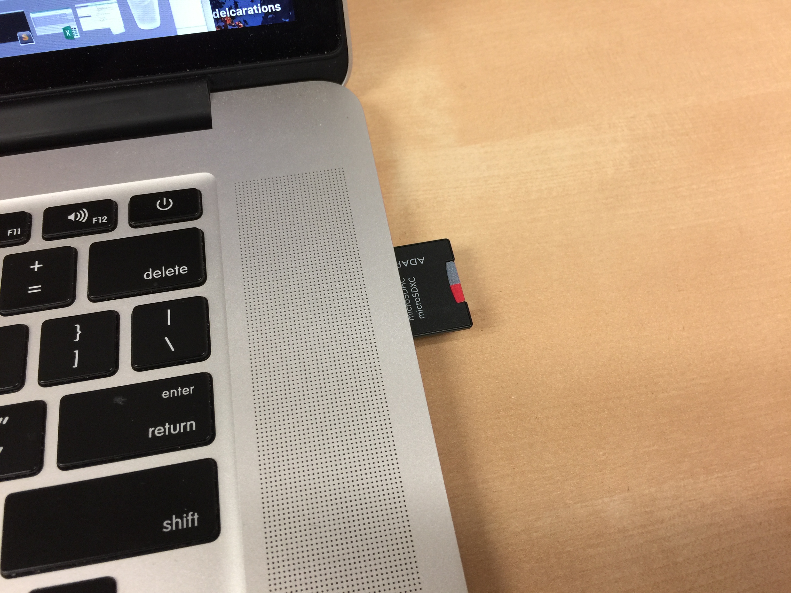
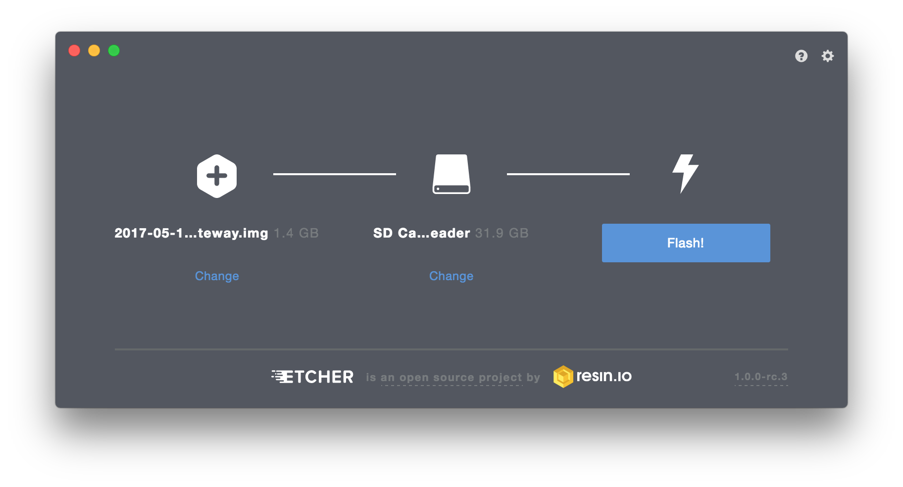
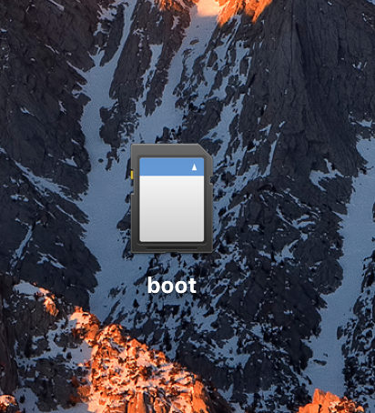

# Gateway

## Introduction

The gateway is the central hub of communication for a PRISMS sensor system. Sensors transmit their data to a gateway and the gateway takes care of uploading the data to the a remote database:

The gateway consists of multiple components. The major component is [Home Assistant](https://home-assistant.io). Home Assistant is the common foundation that all sensors must support. It provides many built-in components with ways to add custom components. These components tell Home Assistant how to interact with various types of sensors. The PRISMS sensor component communicates with PRISMS sensors, integrating them into Home Assistant. The PRISMS InfluxDB component takes any data that is given to Home Assistant and uploads it to a [InfluxDB server](https://github.com/influxdata/influxdb). The PRISMS InfluxDB component also provides data persistence in case the gateway loses power and has not been able to upload all of the collected data. The source for the PRISMS components can be found [here](https://github.com/VDL-PRISM/home-assistant-components).  The last component, [ngrok](https://ngrok.com) is a service that allows you to connect to your gateway after it has been deployed. This is helpful for remote debugging and monitoring. It is not required.

We have built a custom disk image to simplify the building and setting up a gateway. The image comes pre-installed with the PRISMS components and other helpful software. The following instructions outline how to build and set up a gateway.

_Note: We assume that you have access to a server running InfluxDB to upload data._

## Gateway Parts
- [Raspberry Pi 3](https://www.raspberrypi.org/products/raspberry-pi-3-model-b/)
- Micro USB power supply ([example](https://www.adafruit.com/product/1995))
- microSD card -- at least 8 GB, 32 GB is recommended ([example](https://www.amazon.com/dp/B010Q57T02/ref=twister_B011BRUOMO))
- Computer with SD card reader
- Case for Raspberry Pi (optional)

## Building a Gateway

To build a gateway, you must first download and flash the custom disk image to the SD card. Then you must customize the disk image for your specific deployment. Lastly, you build the gateway.

### Download the Image
Download the PRISMS Gateway image from [here](https://www.files.app.lundrigan.org/2017-05-10-prisms-gateway.img.zip).

### Writing Image to the SD Card
In order to copy the image file to an SD card, you need special software that "flashes" the SD card with the disk image. Many tools exist, but we like an app called [Etcher](https://etcher.io).

Once you have Etcher downloaded and installed, plug in your SD card into your computer and run Etcher.

Select the image PRISMS image you downloaded. Etcher typically detects if an SD card is plugged in and selects the correct drive for you. Confirm that this is the correct drive. Lastly, click the “Flash!” button. Once the process is complete, keep the SD card plugged into your computer.

### Configure SD Card
With the SD card mounted, open up the “boot” drive and locate the `device-init.yaml` file in the top level directory.

This file allows you to customize your gateway for a deployment. The first time the gateway runs, it looks for this file and configures itself. This file will only be used on the first boot so any changes made after the first boot will not take affect.

The configuration file is a [YAML file](http://yaml.org) which has a specific format and syntax. If you are unfamiliar with YAML, you should take a few minutes to familiarize yourself. It is not a complicated format, but it is worth understanding. There are lots of resources online for learning more about it ([here](https://learnxinyminutes.com/docs/yaml/) and [here](https://www.youtube.com/watch?v=W3tQPk8DNbk)).

There are four main parts to this file: `hostname`, `password`, `ngrok`, `home_assistant`. `hostname` changes the name of the computer. For most cases, the default ("gateway") works fine. `password` changes the password of the gateway computer. Make sure to change this. `ngrok` allows you to configure the [ngrok service](https://ngrok.com). To read more about how to configure ngrok, see the [ngrok documentation](https://ngrok.com/docs#config). The last part is `home_assistant`. This is where all configuration for Home Assistant goes.

There are 12 places where the `device-init.yaml` configuration needs to be changed. Everything else can stay the same unless you want to customize your gateway further. If you don't plan on using ngrok, then you can delete the whole `ngrok` section. The `prisms_influxdb` subsection (under `home_assistant`) is where you put information about the InfluxDB server you want the gateway to connect to.

Once you have updated this file, save your changes. Your gateway is now customized!

If you are new to YAML, it might be a good idea to run the file through a YAML Linter to make sure you didn't make any mistakes in the format. Copy the contents of the file and paste it into [this website](http://www.yamllint.com). It will tell you if your YAML format is correct or not.

### Build Gateway
Unmount the SD card from your computer and plug it into the Raspberry Pi. If you have a case, put the case on the Raspberry Pi. Plug the gateway into an Ethernet cable that is connected to the Internet, then connect the power cable. The gateway's first boot will take about 5 minutes to complete because it is configuring itself. Once the gateway has rebooted twice, it is ready to go.

### Finish

Home Assistant provides a web interface that shows the values of all the sensors connected. To access this web interface, got to `http://[gateway-ip-address]:8123`. If you are using a Mac, Linux, or Windows computer with iTunes[^1], you can use the gateway's hostname to connect to it. If you left the host name as `gateway`, then you could go to `http://gateway.local:8123`. You must be on the same network as the gateway for this to work.

If you have ngrok setup, you can connect remotely through `https://[subdomain].ngrok.io` replacing `[subdomain]` with the subdomain you configured ngrok with.

[^1]: Using `.local` requires that you have Bonjour or zeroconf running on your computer. This is turned on by default for Mac and Linux computers. Installing iTunes on a Windows computer also turns on this feature.
